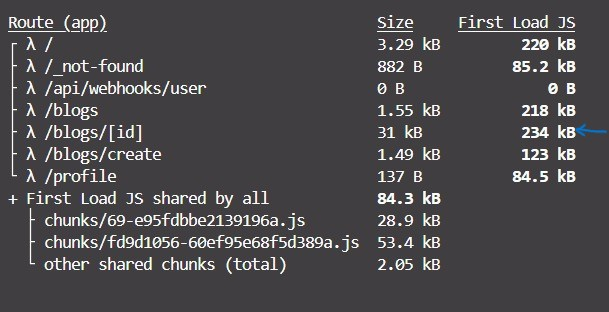
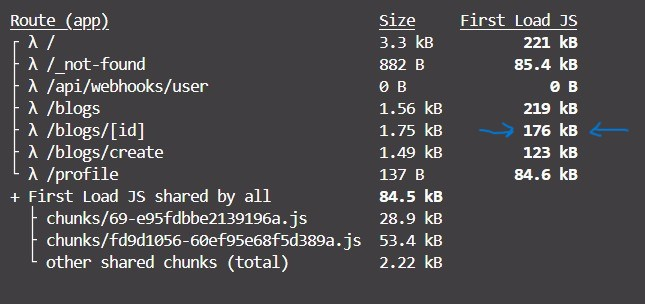

# Task 3: Optimizing Next.js Application Performance

## Objective

Optimize the performance of a Next.js application by implementing lazy loading for components and optimizing bundle size.

## Requirements

- Implement lazy loading for heavy components using `React.lazy` and `Suspense`.
- Split the bundle using dynamic imports.
- Measure and optimize bundle size using Webpack Bundle Analyzer.
- Ensure the application remains performant and responsive.

## Steps Taken

1. **Implemented Lazy Loading**

   - Used `React.lazy` and `Suspense` to implement lazy loading for blogs page.

2. **Dynamic Imports**

   - Specifically,
     imported `Dialog` and `Drawer` from MUI.
   - Split the bundle using dynamic imports to ensure only necessary code is loaded initially.

3. **Bundle Size Optimization**

   - Measured bundle size using Webpack Bundle Analyzer.
   - Before adding drawer and dialog to blog detail pages, the first load was 200 KB.
   - After adding `Dialog` and `Drawer`, the size increased to 255 KB.
   - After dynamically import, the bundle size reduced to 207 KB.

4. **Loading State**
   - Added `React.Suspense` and `React.lazy` to show a loading message until the blogs content is loaded.

## Results

- Effective use of lazy loading and dynamic imports.
- Significant reduction in bundle size.
- Proper usage of Webpack Bundle Analyzer.
- Maintained application performance and responsiveness.

## Evaluation Criteria

- Effective use of lazy loading and dynamic imports.
- Significant reduction in bundle size.
- Proper usage of Webpack Bundle Analyzer.
- Maintenance of application performance and responsiveness.

## Screenshots

- ** Import Dialog and Drawer Components without dynamic import **: Bundle size - 234 KB ->` blogs/id page`
  
- **After Dynamic Import**: Bundle size - 176 KB -> `blogs/id page`
  
